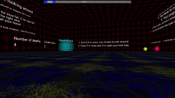

Greetings, my name is Lenka Koplíková.

I study informatics at Slovak univerity of technology, and after I graduate, I aim to be employed in gaming industry.
If you would like to know more about my career, skills, achievements and hobbies, please navigate to my [CV](./CV).

# Experience
## Videogames
### The Path
This was my first experience with videogame making. Competition Špongia is known mostly among high school students. Competitors have 17 days to make a videdo game from scratch to fit assigned theme. Our game was playable, but not so visualy pleasing, mostly for the lack of graphic designer.

My assigned role was game developer, but I helped also with coding.

Image below shows intro to the final version of our game and you can see trailer [here](https://www.youtube.com/watch?v=HqknSmS59xw).

### Mahjong
This game was made for school project. I've learned to create a game from scratch at OpenGL, using gravitation, phong lighting and more. It was fun to make my own graphics, even though they were nowhere near perfect

## Dragons and Dungeons
I've been playing D&D since 2009, both as player and dungeon master. I've developed skills in observation of situation, strategical thinking, teamwork, patience, creative thinking, improvisation and character design.

## Tabletop games
I've started to create games at early age. 

